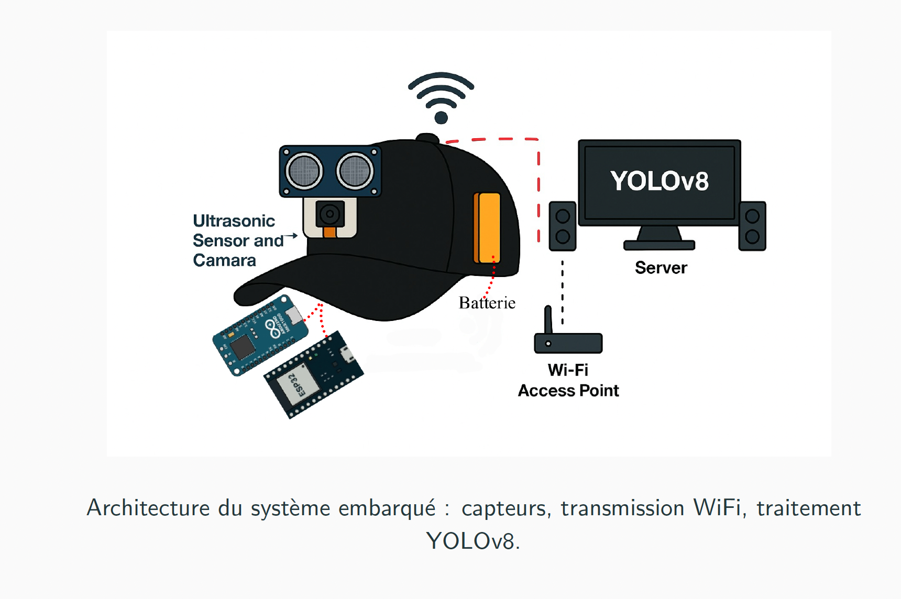

# 🧢 Casquette intelligente pour personnes mal-voyantes

## 🎯 Objectif du projet
Ce projet a été réalisé pour répondre à un besoin : aider les personnes malvoyantes à
mieux détecter et éviter les obstacles lors de leurs déplacements. La problématique
identifiée est que les aides existantes, comme les cannes intelligentes, détectent les
obstacles, mais ne reconnaissent pas visuellement les objets ni ne conseillent une
direction précise à suivre.
Notre hypothèse est qu’en combinant une détection par ultrasons avec une recon-
naissance visuelle basée sur l’intelligence artificielle, il est possible d’offrir une aide
plus efficace et plus intelligente pour la navigation.
Le rapport vise à concevoir, construire et tester un prototype capable de détecter
visuellement et physiquement les obstacles, et de recommander dynamiquement
une direction sécuritaire à l’utilisateur. 

## 🧰 Technologies utilisées
Python, Arduino, ESP32-CAM, OpenCV, YOLOv8, Socket réseau

## 🖼️ Images du projet

## 🎥 Démonstration
<iframe width="560" height="315" src="https://www.youtube.com/embed/TON_CODE_VIDEO" frameborder="0" allowfullscreen></iframe>

## 🔎 Fonctionnement
1. Détection de l’obstacle
2. Capture et traitement d’image
3. Identification de l’objet
4. Direction à suivre
5. Alerte audio via haut-parleur

[⬅️ Retour aux projets](projets.md)

