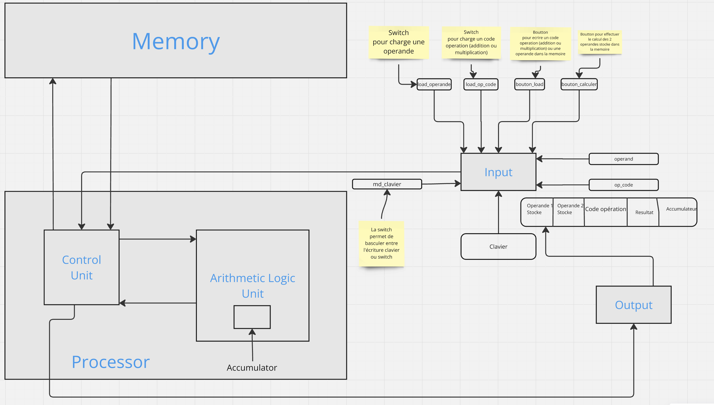
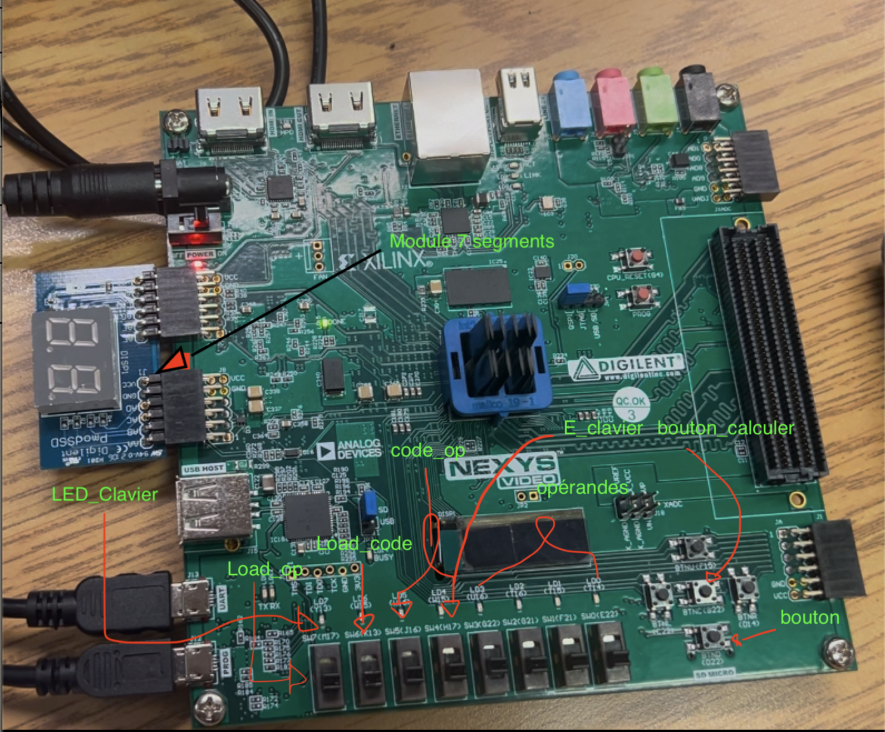

# ⚙️ Processeur de signal numérique (DSP) sur FPGA

## 🎯 Objectif du projet
Ce projet a pour but de concevoir un processeur de signal
num´erique (DSP) simplifi´e sur un FPGA nexys vid´eo pour les
taches de traitement de signal de base avec un jeu d’instruction
´etendu. Il sera concu avec un noyau DSP de base avec
une architecture de pipeline simple, comportant une unit´e
logique arithm´etique avec les op´erations suivantes : addition,
multiplication et accumulation et une interface m´emoire de
base pour charger les instructions et les donn´ees dans le noyau
DSP

## Architecture du système

## 🧰 Technologies utilisées
  VHDL, FPGA

## 🖼️ Images du projet

## 🎥 Démonstration

[⬅️ Retour aux projets](projets.md)
