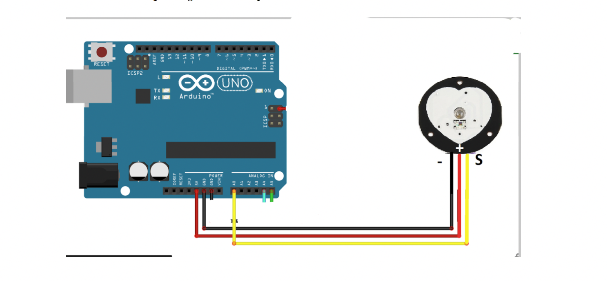

# ❤️ Suivi en temps réel du rythme cardiaque

## 🎯 Objectif du projet
Ce projet a pour but de développer un système avancé pour le suivi en temps réel du
rythme cardiaque à l’aide d’un microcontrôleur Arduino. En captant les signaux analogiques
émis par un capteur de fréquence cardiaque, le système est capable de traiter ces données
pour fournir une visualisation dynamique et continue du rythme cardiaque sur une interface
web.
Le système est conçu pour être simple mais efficace, permettant une lecture précise du
rythme cardiaque qui peut être utilisée pour des applications telles que le suivi de la condi-
tion physique, la surveillance médicale à domicile ou même des expériences éducatives. Ce
projet illustre non seulement l’intégration des technologies de capteurs et de microcontrô-
leurs, mais offre également une interface utilisateur intuitive pour visualiser et comprendre
les données en temps réel.

## 🧰 Technologies utilisées
 Arduino, Python, Flask

## 🖼️ Images du projet

## 🎥 Démonstration

[⬅️ Retour aux projets](projets.md)

